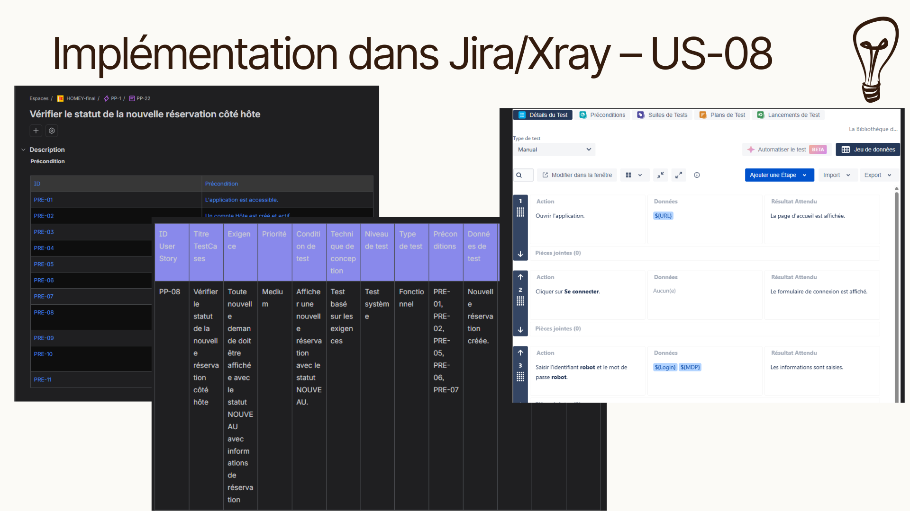
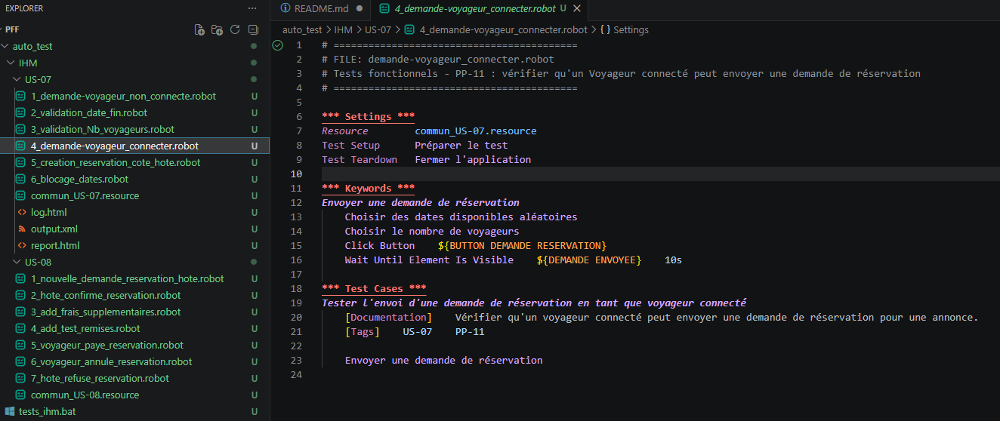
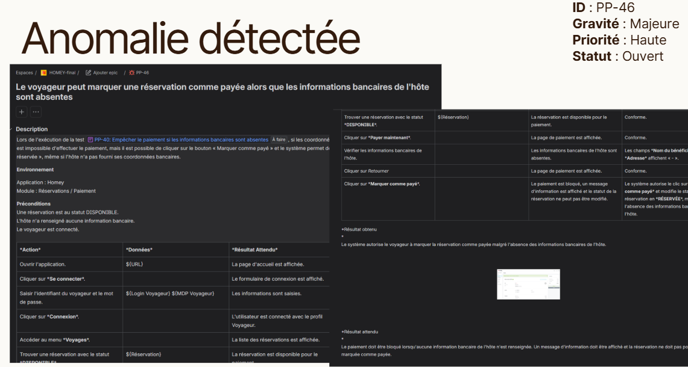
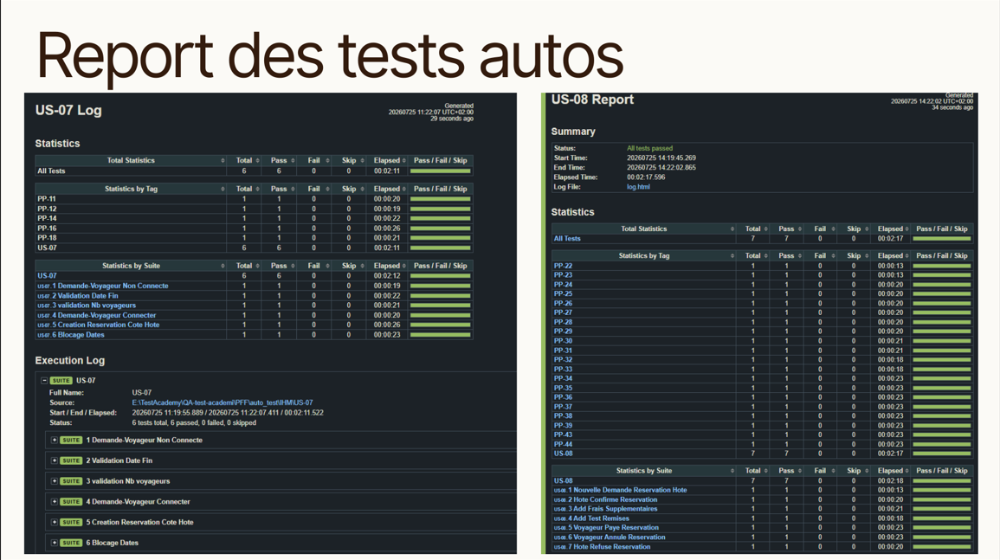

# Homey QA Automation Project


End-to-end QA project covering requirements analysis, manual testing, Robot Framework UI automation, Jira/Xray test management, defect reporting.

## Overview

This repository contains my final QA automation project developed during the **Test Academy – Software Tester** training.

The project demonstrates the complete software testing lifecycle, from requirements analysis and manual test design to automated UI testing, defect reporting and project documentation.

## Project Highlights

### Jira / Xray Test Management



### Robot Framework Automation



### Robot Framework Report





## Application Under Test

**Homey** is a vacation rental web application that allows travelers to search accommodations, create booking requests and manage reservations with hosts.

---

## Project Scope

The project covers two business-critical user stories.

### US-07 – Make a Booking Request

- Accommodation search
- Date selection
- Booking request creation
- Reservation verification

### US-08 – Process a Booking Request

- Host reservation management
- Reservation confirmation
- Reservation refusal
- Payment workflow
- Reservation cancellation
- Reservation status transitions

---

## Testing Activities

The following QA activities were completed:

- Requirements analysis
- Test strategy and test planning
- Manual test design
- Test data preparation
- Manual test execution
- UI test automation
- Defect reporting
- Test execution reporting
- Test documentation

---

## Project Statistics

- **2 User Stories**
- **30 Manual Test Cases**
- **13 Automated UI Tests**
- **1 Critical Defects Reported**

---

## Technologies

| Category        | Technologies                     |
| --------------- | -------------------------------- |
| Test Management | Jira, Xray                       |
| UI Automation   | Robot Framework, SeleniumLibrary |
| Programming     | Python                           |
| Documentation   | Markdown, Excel                  |
| Manual Testing  | Browser DevTools                 |
| Version Control | Git, GitHub                      |

---

## Project Structure

```text
├── README.md
├── Test_plan.md
├── Test_strategy.md
│
├── auto_test/
│   ├── tests_ihm.bat
│   ├── IHM/
│   │   ├── US-07/
│   │   └── US-08/
│   └── results/
│       └── IHM/
│           ├── log.html
│           ├── output.xml
│           └── report.html
│
└── manual_test/
    ├── Test Summary Report.md
    ├── analysis/
    │   ├── US-07.md
    │   └── US-08.md
    ├── design/
    │   ├── US-07_TestCases.xlsx
    │   └── US-08_TestCases.xlsx
    ├── implementation/
    │   ├── US-07/
    │   └── US-08/
    ├── execution/
    │   └── Execution_Report.xlsx
    └── bugs/
        └── PP-46...
```

---

---

## Automated Testing

The automated test suite was developed using **Robot Framework** and **SeleniumLibrary**.

The automated test suite covers the following business scenarios:

### US-07

- Booking request creation
- Reservation verification
- Date validation
- Guest number validation
- Reservation visibility for the host
- Reserved dates validation

### US-08

- New reservation processing
- Reservation confirmation
- Reservation refusal
- Additional fees
- Discounts
- Payment process
- Reservation cancellation
- Payment confirmation

---

## Defects Found

During testing, one major business defects were identified:

- **PP-46** – A traveler can mark a reservation as paid even when the host has not configured banking information.

Both defects were documented and reported.

---

## Future Improvements

- Add REST API automated tests
- Integrate automated tests with Jenkins
- Configure CI/CD execution
- Generate automated test metrics

## Key Achievements

- Completed the full QA testing lifecycle
- Designed and executed manual test cases
- Automated critical business scenarios using Robot Framework
- Reported major business defects
- Produced complete QA documentation

## Author

**Inna Pykhtina**

Junior QA Automation Engineer

🎓 ISTQB® CTFL v4 Certified

### Skills

- Robot Framework
- SeleniumLibrary
- Python
- Jira / Xray
- Jenkins
- Git & GitHub
