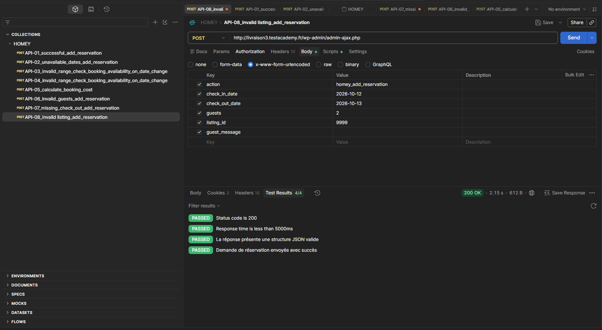
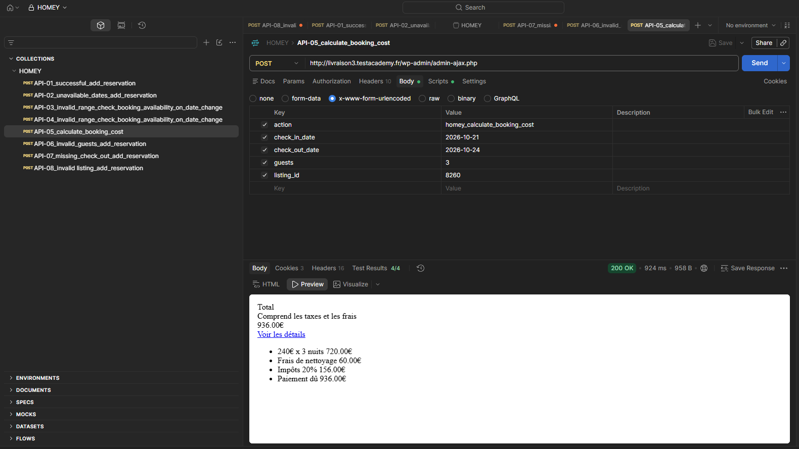

# Homey API Testing – Postman

This folder contains the API testing work performed on the Homey application using Postman.

## Scope

The API testing focuses on the reservation request functionality (US-07).

The API was investigated through browser DevTools and tested directly with Postman because no official API documentation was available.

## Endpoint

**POST** `/wp-admin/admin-ajax.php`

**Content-Type:** `application/x-www-form-urlencoded`

## Tested scenarios

| ID     | Scenario                  | Expected result                                            |
| ------ | ------------------------- | ---------------------------------------------------------- |
| API-01 | Successful reservation    | Reservation request is created                             |
| API-02 | Unavailable dates         | Request is rejected                                        |
| API-03 | Check-out before check-in | Request is rejected                                        |
| API-04 | Check-out equals check-in | Request is rejected                                        |
| API-05 | Calculate booking cost    | Booking cost information is returned                       |
| API-06 | Invalid number of guests  | Request is rejected                                        |
| API-07 | Missing check-out date    | Request is rejected                                        |
| API-08 | Invalid listing ID        | API response is checked against the actual business result |

## Important finding

For API-08, the API returns HTTP 200 and `success: true` even when an invalid listing ID is provided.

However, verification in the application showed that no reservation was actually created.

This demonstrates that checking only the HTTP status code or the `success` field is not sufficient to validate the business result.

## Test documentation

* API test cases and business requirements (Homey_API_Test_Cases.xlsx)
* Postman collection (postman/Homey_API_Tests.postman_collection.json)

## Screenshots

## Tools

- Postman
- Browser DevTools / Network
- REST API
- WordPress AJAX endpoint
