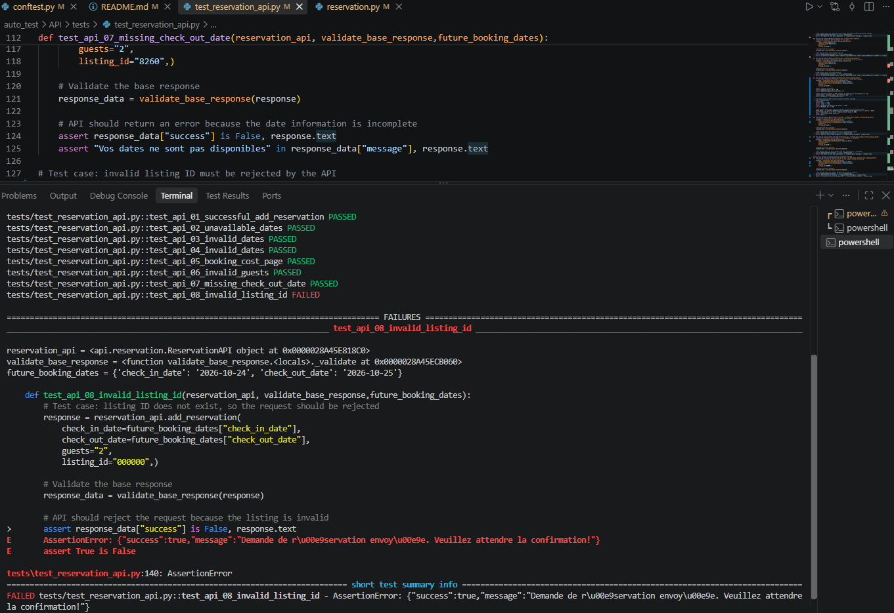

# Homey API Testing – Postman & Python

## Test documentation

The project includes:

* **Homey API test cases and business requirements:** `Homey_API_Test_Cases.xlsx`
* **Postman collection:** `postman/Homey_API_Tests.postman_collection.json`
* **Python API tests:** `tests/test_reservation_api.py`
* **Reusable API client:** `api/client.py`
* **Reservation API layer:** `api/reservation.py`

## Tools

* Postman
* Python
* pytest
* requests
* Browser DevTools / Network
* Git / GitHub

## Objective

This project covers API testing of the reservation functionality of the Homey application.

The objective was to:

* investigate the API through browser DevTools;
* identify the requests used by the application;
* design functional and negative API test cases;
* validate API responses and business rules;
* execute the tests with Postman;
* automate the API tests using Python, pytest and requests;
* identify discrepancies between API responses and the actual application behaviour.

## Scope

The testing focuses on the reservation functionality related to **US-07**.

The following areas were covered:

* reservation requests;
* booking date validation;
* guest validation;
* listing validation;
* booking cost calculation;
* response status and structure;
* response messages;
* basic response-time validation.

No official API documentation was available, so the API behaviour was investigated using the browser Network tab and application requests.

## Test approach

The API testing was performed in several steps:

1. **API investigation**

   * Analysed network requests using browser DevTools.
   * Identified the AJAX endpoint, request parameters and required authentication.
   * Analysed successful and unsuccessful responses.
2. **Test design**

   * Created positive and negative test scenarios.
   * Covered valid data, invalid dates, invalid guests, missing data and invalid listing IDs.
3. **Manual API testing**

   * Implemented the scenarios in Postman.
   * Validated HTTP status, response content, business messages and response format.
4. **API automation**

   * Reimplemented the tests in Python using pytest and requests.
   * Created a reusable API client and reservation API layer.
   * Added authentication through a reusable session.
5. **Application verification**

   * Compared API responses with the actual behaviour observed in the application.
   * Investigated discrepancies between technical API responses and business results.

## API endpoint

**Method:** `POST`

**Endpoint:** `/wp-admin/admin-ajax.php`

**Content-Type:** `application/x-www-form-urlencoded`

The following AJAX actions were tested:

* `homey_add_reservation`
* `check_booking_availability_on_date_change`
* `homey_calculate_booking_cost`

### Main request parameters

| Parameter          | Description                 |
| ------------------ | --------------------------- |
| `action`         | Homey AJAX action           |
| `check_in_date`  | Check-in date               |
| `check_out_date` | Check-out date              |
| `guests`         | Number of guests            |
| `listing_id`     | Property/listing identifier |

## Authentication

The reservation API requires an authenticated session.

For automated tests, a `requests.Session()` is used to:

1. access the application;
2. retrieve the dynamic login security token;
3. authenticate the test user;
4. preserve the session cookies;
5. reuse the authenticated session for subsequent API requests.

Authentication is handled through pytest fixtures so that the API tests can reuse the same setup without duplicating login logic.

Credentials are not stored in the repository.

## Tested scenarios

| ID     | Scenario                  | Expected result                                                 | Automation      |
| ------ | ------------------------- | --------------------------------------------------------------- | --------------- |
| API-01 | Valid reservation request | Reservation request is accepted                                 | Python / pytest |
| API-02 | Unavailable dates         | Request is rejected                                             | Python / pytest |
| API-03 | Check-out before check-in | Request is rejected                                             | Python / pytest |
| API-04 | Check-out equals check-in | Request is rejected                                             | Python / pytest |
| API-05 | Calculate booking cost    | Booking cost information is returned                            | Python / pytest |
| API-06 | Invalid number of guests  | Request is rejected                                             | Python / pytest |
| API-07 | Missing check-out date    | Request is rejected                                             | Python / pytest |
| API-08 | Invalid listing ID        | Invalid listing should not produce a successful business result | Python / pytest |

## Automation

The API tests were automated using:

* **Python**
* **pytest**
* **requests**

The automation is structured into separate layers:

```text
api/
├── client.py
└── reservation.py

tests/
├── conftest.py
└── test_reservation_api.py
```

### API client

`client.py` contains the reusable HTTP client responsible for sending requests to the AJAX endpoint.

### Reservation API

`reservation.py` contains the reservation-related API operations:

* add reservation;
* check booking availability;
* calculate booking cost.

This separates HTTP communication from Homey-specific API operations.

### Test layer

`test_reservation_api.py` contains the functional API test scenarios.

Common test setup and reusable fixtures are managed in `conftest.py`, including:

* authentication;
* API client creation;
* reservation API creation;
* dynamic future booking dates;
* common response validation.

## Findings & Defects

### API-08 – Invalid listing ID

An invalid `listing_id` was used to verify how the API handles a non-existent listing.

The API returned:

* HTTP `200`;
* `success: true`.

However, additional verification in the application showed that no valid reservation was actually created because the listing does not exist.

This revealed a discrepancy between the technical API response and the actual business result.

The automated test expects the invalid listing request to be rejected (`success: false`). The current API response does not meet this expectation, so the test currently fails against the existing API behaviour.

**QA conclusion:** the `success` field alone cannot be considered sufficient evidence that the requested business operation was successfully completed.

### API-05 – Zero-night booking

An edge case was identified during booking cost testing when the check-in and check-out dates are identical.

The API returned a booking cost containing:

```text
240€ x 0 nuit
```

while still returning a positive total amount.

The response did not contain the expected cleaning fee in this case.

This behaviour requires clarification against the business requirements: a zero-night booking may need to be rejected, or the calculation may need to return a different result.

**QA conclusion:** this behaviour is documented as an edge case requiring clarification against the expected business rule.

The automated API-05 test currently validates the structure and content of the returned cost information rather than hardcoding a specific price, since the booking price depends on the listing and booking data.

## Key QA findings

The testing highlighted several important points:

* HTTP `200` does not necessarily mean that the business operation was successful.
* The API `success` field should be validated together with the actual business result.
* Negative scenarios are essential for validating API business rules.
* Dynamic test data is preferable to hardcoded dates for repeatable automation.
* Booking cost responses are returned as HTML fragments and require content-level validation.
* Edge cases such as identical check-in and check-out dates can reveal unexpected business behaviour.
* API automation can detect issues that may not be visible from status codes alone.

## Screenshots

Postman collection


Postman test execution


Pytest


